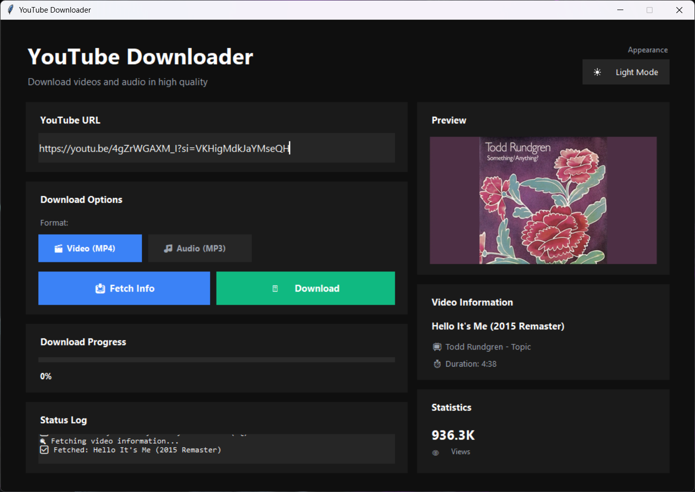

# 🎬 YouTube Audio / Video Downloader (GUI) 

A Python-based desktop GUI application that allows users to:

- 🎥 Download YouTube videos (MP4)
- 🎵 Download audio only (MP3)
- 📦 Batch download multiple URLs
- 📊 View video metadata before downloading
- 🛡️ Handle errors gracefully without crashing

Built using **Tkinter** for the GUI and **yt-dlp** for reliable YouTube extraction.

---

## 📸 Application Preview



> ℹ️ This screenshot shows the GUI displaying video metadata such as title, duration, views, and likes before downloading.

---

## 🚀 Features

- ✅ Graphical User Interface (GUI)
- ✅ Audio (MP3) & Video (MP4) downloads
- ✅ Batch download support (multiple URLs)
- ✅ Fetch video information:
  - Title
  - Duration
  - Views
  - Likes
  - Channel name
- ✅ Error handling for:
  - Invalid URLs
  - Network issues
  - Removed/private videos
- ✅ Works on **Python 3.11+ (including 3.13)**

---

## 🧰 Technologies Used

- **Python**
- **Tkinter** – GUI framework
- **yt-dlp** – YouTube downloading engine
- **FFmpeg** – Audio conversion & video merging
- **Pillow** 

---

## 📁 Project Structure

```bash
YouTubeDownloader/
│
├── app.py
├── requirements.txt
│
├── controllers/
│   └── controller.py
│
├── models/
│   └── downloader.py
│
├── views/
│   └── main_view.py   ✅ (already given)
│
├── utils/
│   └── formatters.py
│
└── downloads/
```
---

## ⚙️ Requirements

### 1️⃣ Python
- Python **3.11 or newer**
- Download: https://www.python.org/

Verify:
```bash
py --version
```
## Installing yt-dlp
```bash
pip install yt-dlp
```
## FFmpeg (Required)

